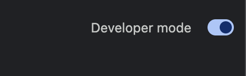
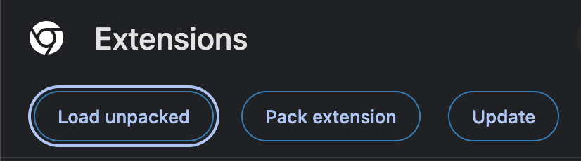

# Slack Extended

A chrome extension that enhances the Slack web app with additional features.


## Install

> **Note:** Google Chrome requires a $5 developer fee to publish extensions. I'm not paying them 😄 so you'll need to install this manually!

1. Clone this repository:
   ```sh
   git clone https://github.com/imranbarbhuiya/slack-extended.git
   cd slack-extended
   ```
2. Install dependencies:
   ```sh
   pnpm i
   ```
3. Build the extension:
   ```sh
   pnpm build
   ```
4. Open Chrome and go to the Extensions menu (`chrome://extensions/`).
5. Enable "Developer mode" (toggle in the top right).
   
6. Click "Load unpacked" and select the `build/chrome-mv3-prod` folder from the cloned repository.
   
7. Enjoy!

## Features

> **Note:** You must have `Format messages with markup` enabled in Slack settings.
> Click on your profile picture in the bottom left corner, go to `Preferences`, then `Advanced`, and enable `Format messages with markup`.

1. Reply Button: Adds a reply button to each message for quick replies.
2. Copy Button: Adds a copy button to each message for easy copying the message text with markdown formatting.
3. Hide forms and always show input box.

All these features can be toggled on or off in the extension's popup menu.

There are 2 types of reply ui:

1. Quote reply:
   
2. Codeblock reply:
   

## Acknowledgements

This extension is inspired by and most of the reply feature's initial code is taken from [Slack Reply](https://github.com/pashpashpash/slack-reply).
